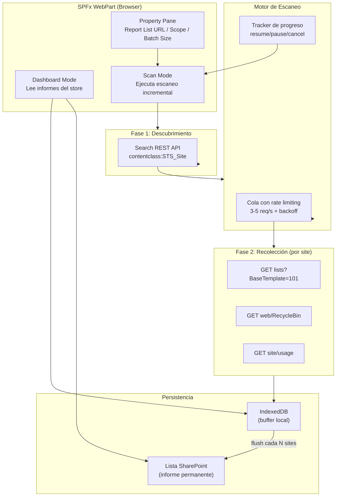
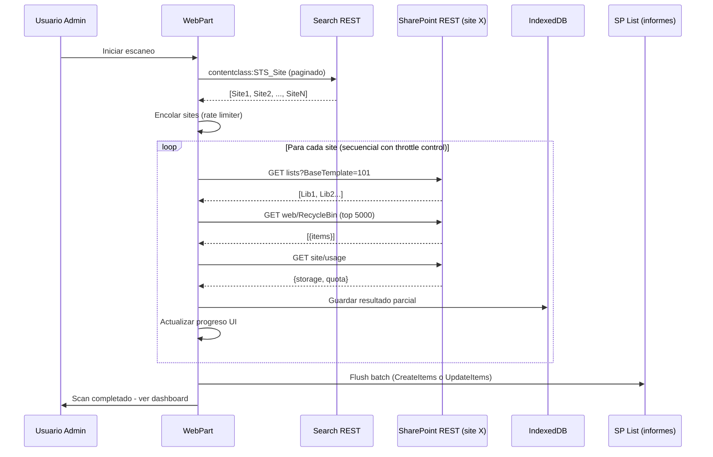

# Análisis de viabilidad: Escaneo cross-site-collection

## Resumen ejecutivo

Se investiga si el webpart puede escalar para analizar bibliotecas, papeleras y versionado de documentos en **todas las colecciones de sitios a las que tiene acceso el usuario administrador**, con ejecución secuencial o en batch y persistencia de informes.

**Veredicto**: Es técnicamente viable con una arquitectura híbrida y restricciones de diseño, pero NO es viable con el enfoque ingenuo de "escanear todo desde un bucle en el navegador". Requiere una reestructuración significativa del producto.

---

## 1. Análisis de viabilidad técnica

### 1.1 Acceso cross-site desde SPFx

| Aspecto | Estado | Evidencia |
|---------|--------|-----------|
| `SPHttpClient` puede llamar a otras colecciones de sitios con URL absoluta | **SÍ** | El token OAuth del usuario se transmite; SharePoint valida permisos por sitio destino |
| El usuario admin tiene acceso a papeleras y bibliotecas de otros sites | **SÍ** | SharePoint Admin / Site Collection Admin tiene lectura implícita |
| Se necesitan permisos adicionales en `package-solution.json` | **DEPENDE** | Solo si se usa Graph para descubrir sites; no si se usa Search REST |

### 1.2 Descubrimiento de colecciones de sitios

| Método | Pros | Contras |
|--------|------|---------|
| SharePoint Search: `contentclass:STS_Site` | No requiere permisos Graph; respeta permisos del usuario; rápido | Lag de indexación ~15min; puede omitir sites ocultos |
| Graph `/sites?search=*` | Estructura moderna; paginable | Requiere `Sites.Read.All` delegado; máx ~200 resultados sin paginación |
| Graph `/sites/getAllSites` | Enumera todo el tenant | Requiere permiso de aplicación (no delegado); impacto gobernanza alto |

**Decisión recomendada**: Search REST como fuente primaria. No requiere permisos Graph adicionales. Acepta el trade-off de lag de indexación.

### 1.3 APIs para cada colección de sitios

Para cumplir el objetivo funcional completo, por cada site collection se necesita:

| Dato | API | Coste estimado |
|------|-----|----------------|
| Lista de bibliotecas de documentos | `{siteUrl}/_api/web/lists?$filter=BaseTemplate eq 101&$select=Id,Title,ItemCount` | 1 call |
| Papelera nivel 1 (conteo + tamaño) | `{siteUrl}/_api/web/RecycleBin?$top=5000&$select=Id,Size,LeafName,DeletedDate` | 1-N calls (paginado) |
| Uso de almacenamiento del sitio | `{siteUrl}/_api/site/usage` | 1 call |
| Versionado: tamaño de versiones por biblioteca | `{siteUrl}/_api/web/lists(guid'{id}')/items?$select=Id,File/Length&$expand=File&$top=5000` | 1-N calls × M bibliotecas |
| Versionado: versiones por documento | `{siteUrl}/_api/web/lists(guid'{id}')/items({itemId})/versions` | 1 call × K documentos |

**Coste por sitio (estimación conservadora)**: 3-5 calls mínimo (sin versionado detallado) hasta 50-500+ calls (con versionado documento a documento).

---

## 2. Análisis adversarial — Fallas identificadas

### CRÍTICO-01: Explosión combinatoria del versionado

**Problema**: Consultar versiones documento a documento es un problema N×M×K (N sites × M bibliotecas × K documentos). Un tenant con 100 sites, 5 bibliotecas/site y 1000 docs/biblioteca = 500.000 llamadas API solo para versionado.

**Impacto**: Inviable técnicamente. Throttling garantizado. Tiempo de ejecución: horas/días.

**Mitigación**: El versionado detallado NO puede ser parte del escaneo general. Solo puede ser un drill-down bajo demanda para una biblioteca específica. Para métricas agregadas, usar `_api/site/usage` que da almacenamiento total (incluye versiones) sin desglosar por documento.

### CRÍTICO-02: Throttling de SharePoint Online

**Problema**: SharePoint aplica throttling basado en consumo de recursos (~2000 requests / 5min / usuario / tenant como referencia general). Un escaneo de 200 sites × 5 calls = 1000 calls en ráfaga dispara throttling en la primera oleada.

**Impacto**: Degradación del escaneo, errores 429, pausas forzadas de 30-120s, scan que tarda 15-60 minutos.

**Mitigación**:
- Rate limiter client-side: máximo 3-5 requests/segundo
- Respeto obligatorio de `Retry-After`
- Cola de prioridad con backoff exponencial
- Procesamiento secuencial por site (no paralelo masivo)

### CRÍTICO-03: Resiliencia del navegador

**Problema**: Un scan de 10-30 minutos en un tab del navegador es frágil. El usuario puede cerrar el tab, navegar a otra página, o el token puede expirar (60-90min pero con variabilidad).

**Impacto**: Pérdida total del progreso del scan.

**Mitigación**:
- Persistencia incremental: guardar resultados por site tan pronto se obtengan
- Diseño "resume": el scan puede retomarse desde el último site completado
- Indicador visual claro de progreso con estimación de tiempo restante
- SPFx auto-refresca tokens silenciosamente, pero implementar handler de 401

### ALTO-01: Descubrimiento incompleto de sites

**Problema**: Ningún método de descubrimiento garantiza el 100% de los sites. Search tiene lag de indexación y puede omitir sites sin contenido indexado. Graph delegado respeta permisos pero tiene límites de paginación.

**Impacto**: El informe puede ser incompleto sin que el usuario lo sepa.

**Mitigación**:
- Declarar explícitamente "sites descubiertos via Search" con timestamp
- Permitir añadir sites manualmente (URL directa)
- Mostrar conteo de sites encontrados vs. sites escaneados

### ALTO-02: Gobernanza — permisos excesivos

**Problema**: Si se usa Graph para descubrimiento, `Sites.Read.All` concede acceso de lectura a TODO el tenant. Un webpart con esta concesión que cualquier editor pueda añadir a una página es un riesgo de seguridad.

**Impacto**: Auditorías de seguridad rechazarán el despliegue.

**Mitigación**:
- NO usar Graph; usar Search REST (no requiere permisos adicionales)
- Si se necesita Graph, usar `Sites.Selected` + concesión explícita por site
- Desplegar en un site de administración con acceso restringido (no skipFeatureDeployment)
- `isDomainIsolated: false` ya está configurado (correcto)

### ALTO-03: UX degradada durante el scan

**Problema**: Un escaneo largo (5-30 min) con la UI bloqueada o confusa destruye la experiencia.

**Impacto**: El usuario abandona, pierde contexto, o no entiende el estado.

**Mitigación**:
- Separar la UI en dos modos: "Dashboard" (lee informes guardados) y "Scan" (ejecuta nuevo escaneo)
- El dashboard es instantáneo (lee del store)
- El scan muestra progreso granular: barra, site actual, tiempo estimado, opción de pausar/cancelar

### MEDIO-01: Memoria del navegador

**Problema**: Acumular datos de cientos de sites en RAM del tab puede causar OOM o lentitud.

**Impacto**: Tab se cuelga en tenants grandes.

**Mitigación**:
- Flush a almacenamiento persistente cada N sites (no acumular todo en memoria)
- Usar IndexedDB como buffer intermedio
- Limitar items de papelera a métricas agregadas (no almacenar cada item individualmente)

### MEDIO-02: Datos obsoletos del Search

**Problema**: La Search API puede tener 15 minutos de lag. Sites creados recientemente no aparecen.

**Impacto**: Informes pueden omitir sites nuevos.

**Mitigación**: Aceptable para un informe de auditoría periódico. Declarar freshness en el informe.

### MEDIO-03: El webpart actual no implementa nada de esto

**Problema**: El código actual es un `RecycleBinSpaceCalculator` single-site, single-scope. No tiene:
- Descubrimiento de sites
- Iteración multi-site
- Persistencia de informes
- Cola de requests
- Rate limiting
- Modelo de datos para multi-site

**Impacto**: Es una reescritura completa, no una extensión.

---

## 3. Estrategia de persistencia de informes

### Opción seleccionada: SharePoint List + IndexedDB (híbrido)

| Capa | Uso | Tecnología |
|------|-----|------------|
| Cache local | Buffer durante scan + consulta rápida del dashboard | IndexedDB (navegador) |
| Almacenamiento permanente | Informes finalizados, históricos, compartidos | Lista de SharePoint en site admin |
| Metadatos de scan | Estado del escaneo (progreso, último site, errores) | IndexedDB + propiedad del webpart |

**Esquema de la lista de SharePoint** (informe por site):

| Campo | Tipo | Descripción |
|-------|------|-------------|
| SiteUrl | URL | URL de la colección de sitio |
| SiteTitle | Text | Título del site |
| ScanDate | DateTime | Fecha/hora del escaneo |
| LibraryCount | Number | Bibliotecas de documentos encontradas |
| TotalLibraryItems | Number | Items totales en bibliotecas |
| RecycleBinItemCount | Number | Items en papelera nivel 1 |
| RecycleBinSizeBytes | Number | Tamaño de papelera nivel 1 |
| StorageUsedBytes | Number | Almacenamiento total del site |
| StorageQuotaBytes | Number | Cuota asignada |
| HealthLevel | Choice | ok / warning / critical |
| Flags | MultiChoice | oversized-recycle-bin / high-version-count / quota-pressure / stale-deleted-items |
| ScanStatus | Choice | completed / partial / error |
| ErrorMessage | Note | Detalle de error si aplica |
| ScannedBy | Person | Usuario que ejecutó el scan |

**Ventajas de este enfoque**:
- No requiere Azure Functions ni infraestructura adicional
- Los informes son consultables y compartibles
- Histórico natural por fecha de scan
- Permisología controlada por la lista
- El webpart puede leer informes sin reescanear

---

## 4. Arquitectura propuesta





---

## 5. Decisiones de diseño

| # | Decisión | Justificación |
|---|----------|---------------|
| D-01 | Search REST para descubrimiento (no Graph) | Evita `Sites.Read.All`; no requiere admin consent adicional; respeta permisos del usuario |
| D-02 | Versionado solo bajo demanda (drill-down) | Explosión combinatoria hace inviable el scan masivo de versiones |
| D-03 | Procesamiento secuencial por site (no paralelo) | Minimiza throttling; permite resume; más predecible |
| D-04 | Persistencia en lista de SharePoint | Compartible, auditable, no requiere Azure; funciona con permisos estándar |
| D-05 | IndexedDB como buffer intermedio | Resiliencia ante cierre de tab; evita re-scan completo |
| D-06 | Rate limiter de 3-5 req/s | Conservador frente a throttling; ajustable según respuesta del servidor |
| D-07 | Scan pausable/cancelable/resumible | El usuario no debe estar atrapado; el scan puede retomarse |
| D-08 | Dashboard independiente del scan | La consulta de informes previos es instantánea; no depende de un escaneo activo |
| D-09 | Deploy en site admin (no skipFeatureDeployment) | Controla quién puede ejecutar escaneos cross-tenant |
| D-10 | Métricas de site/usage como proxy de versionado | `_api/site/usage` incluye almacenamiento total (versiones incluidas) sin N×M calls |

---

## 6. Riesgos residuales aceptados

| Riesgo | Severidad | Mitigación | Estado |
|--------|-----------|------------|--------|
| Sites no indexados en Search no aparecen | Media | Permitir añadir URLs manualmente; declarar scope en informe | Aceptado |
| Scan de >500 sites tarda >20 min | Media | Progreso visual; pausa; resume; scan parcial por scope | Aceptado |
| Token expira durante scan largo | Baja | SPFx auto-refresh; handler de 401 con retry | Aceptado |
| Lista de informes puede crecer mucho | Baja | Retención por fecha; view con filtro por último scan | Aceptado |
| ItemCount de RecycleBin >5000 requiere paginación | Media | Implementar paginación con $skiptoken | En diseño |
| Browser OOM en tenants enormes | Baja | Flush incremental a IDB; no acumular items en RAM | Mitigado |

---

## 7. Qué NO incluir (scope out explícito)

- **Versionado documento a documento en scan masivo**: Inviable. Solo drill-down por biblioteca individual.
- **Parallelismo agresivo** (>5 requests concurrentes): Garantiza throttling.
- **Permisos de aplicación** (app-only): No necesarios si el usuario es admin.
- **Azure Functions / backend**: El webpart debe ser autónomo (solo client-side).
- **Modificación de datos** (borrar versiones, vaciar papelera): Fuera de scope de un visualizador. Requeriría otra aprobación de seguridad.
- **Scan automático programado**: No hay cron client-side. El usuario inicia manualmente.

---

## 8. Comparativa con alternativas

| Alternativa | Pros | Contras | Veredicto |
|-------------|------|---------|-----------|
| PowerShell script (PnP) | Sin límites de UI; paralelismo real; puede correr en servidor | No visual; no self-service; requiere sesión PowerShell | Complementario, no sustituto |
| Power Automate flow | Programable; puede escribir en lista; tolerante a fallos | Requiere licencia premium para HTTP connector; lógica compleja en Power Automate es frágil | Alternativa viable pero distinto público |
| SPFx webpart (esta propuesta) | Self-service; visual; inmediato; integrado en SharePoint | Limitado por browser; throttling; no background | **Seleccionado** con mitigaciones |
| Azure Function + SPFx UI | Sin límites de browser; escaneo en backend | Requiere infra Azure; coste; complejidad de despliegue | Futuro Phase 2 si el volumen lo requiere |

---

## 9. Plan de desarrollo

### Fase 0: Estabilizar baseline actual (prerequisito)
- Corregir `loc/es-es.js` y `loc/en-us.js` (coma faltante)
- Corregir test roto en `recycleBinSpaceCalculatorRepository.test.ts`
- Validar `npm run build` + tests pasan

### Fase 1: Refactorizar a arquitectura multi-site
**Duración estimada**: Sprint 1

| Tarea | Descripción |
|-------|-------------|
| 1.1 | Definir modelos multi-site: `ISiteReport`, `IScanProgress`, `IScanConfiguration` |
| 1.2 | Crear `SiteDiscoveryRepository` (Search REST, paginado, contentclass:STS_Site) |
| 1.3 | Crear `SiteMetricsRepository` (bibliotecas, papelera, usage — por site individual) |
| 1.4 | Crear `ScanEngine` service: cola, rate limiter (3-5 req/s), backoff, pause/resume/cancel |
| 1.5 | Crear `ReportPersistenceService`: escritura a lista SP + lectura de informes |
| 1.6 | Crear `IndexedDbCacheService`: buffer local, flush, retrieve |
| 1.7 | Property Pane: URL de lista de informes, batch size, scope (all / manual URLs) |
| 1.8 | Tests unitarios de cada servicio y repositorio |

### Fase 2: UI del Scanner
**Duración estimada**: Sprint 2

| Tarea | Descripción |
|-------|-------------|
| 2.1 | Componente `ScanProgressPanel`: barra de progreso, site actual, tiempo estimado, pause/cancel |
| 2.2 | Componente `ScanConfigPanel`: scope, opciones, botón de inicio |
| 2.3 | Hook `useScanEngine`: orquesta el service, expone estado reactivo |
| 2.4 | Gestión de errores por site (no fatal): marca site como `error` y continúa |
| 2.5 | Tests de componentes |

### Fase 3: UI del Dashboard
**Duración estimada**: Sprint 2 (paralelo con Fase 2)

| Tarea | Descripción |
|-------|-------------|
| 3.1 | Componente `ReportDashboard`: tabla/lista de sites con métricas clave |
| 3.2 | Filtros: health level, fecha, flags |
| 3.3 | Ordenación por tamaño, items, ratio papelera/biblioteca |
| 3.4 | Drill-down por site: detalle de bibliotecas, papelera, acciones (abrir site, abrir papelera) |
| 3.5 | Export básico (CSV o link a la lista SP) |
| 3.6 | Tests de componentes |

### Fase 4: Drill-down de versionado (opcional)
**Duración estimada**: Sprint 3

| Tarea | Descripción |
|-------|-------------|
| 4.1 | `VersionAnalysisRepository`: consulta versiones por biblioteca individual (paginado) |
| 4.2 | Componente `VersionAnalysisPanel`: tabla de documentos con nº versiones y tamaño estimado |
| 4.3 | Trigger: usuario selecciona una biblioteca del dashboard y pide "analizar versiones" |
| 4.4 | Guardar resultado del análisis de versiones en la lista de informes (campo adicional) |

### Fase 5: Hardening y gobernanza
**Duración estimada**: Sprint 3

| Tarea | Descripción |
|-------|-------------|
| 5.1 | Telemetría: log de scans ejecutados, duración, errores |
| 5.2 | Retención de informes: política de limpieza de registros antiguos |
| 5.3 | Manifiesto y package-solution actualizados: nombre, descripción, `skipFeatureDeployment: false` |
| 5.4 | Documentación de despliegue: site admin, lista de informes, permisos necesarios |
| 5.5 | Test E2E básico del flujo scan → dashboard |

---

## 10. Estructura de archivos propuesta

```
src/webparts/siteStorageDiagnostics/
├── SiteStorageDiagnosticsWebPart.ts
├── SiteStorageDiagnosticsWebPart.manifest.json
├── models/
│   ├── siteReport.ts           # ISiteReport, IScanProgress, ILibraryMetrics
│   ├── scanConfiguration.ts    # IScanConfiguration, IScanState
│   └── persistence.ts          # IReportListItem, IReportFilter
├── repositories/
│   ├── siteDiscoveryRepository.ts      # Search REST → lista de sites
│   ├── siteMetricsRepository.ts        # Por site: bibliotecas + papelera + usage
│   ├── reportListRepository.ts         # CRUD en lista SP de informes
│   └── versionAnalysisRepository.ts    # Drill-down de versiones (Fase 4)
├── services/
│   ├── scanEngine.ts           # Cola, rate limiter, pause/resume, orchestration
│   ├── rateLimiter.ts          # Token bucket o leaky bucket
│   ├── indexedDbCache.ts       # Buffer local
│   └── healthEvaluator.ts     # Clasificación ok/warning/critical
├── hooks/
│   ├── useScanEngine.ts        # Conecta service con React state
│   ├── useReportDashboard.ts   # Lee informes de la lista
│   └── useVersionAnalysis.ts   # Drill-down
├── components/
│   ├── SiteStorageDiagnostics.tsx      # Orquestador de modos
│   ├── ScanConfigPanel.tsx             # Configuración de scan
│   ├── ScanProgressPanel.tsx           # Progreso
│   ├── ReportDashboard.tsx             # Tabla de informes
│   ├── SiteDetailPanel.tsx             # Drill-down por site
│   ├── VersionAnalysisPanel.tsx        # Fase 4
│   └── WebPartErrorBoundary.tsx        # Reutilizado
├── utils/
│   ├── throttleUtils.ts        # Retry-After parsing, backoff
│   ├── searchQueryBuilder.ts   # Construcción de queries KQL
│   └── formatters.ts           # Bytes, fechas, porcentajes
└── loc/
    ├── mystrings.d.ts
    ├── es-es.js
    └── en-us.js
```

---

## 11. Prerequisitos de infraestructura

1. **Lista de SharePoint** para informes: crearla manualmente o con script de provisioning en un site de administración.
2. **Permisos del usuario**: Site Collection Admin en los sites objetivo (o SharePoint Admin para todo el tenant).
3. **No se requiere**: Azure Function, permisos Graph adicionales, ni `webApiPermissionRequests` si se usa Search REST.
4. **Despliegue recomendado**: Site collection app catalog en el site de administración (no tenant-wide).
