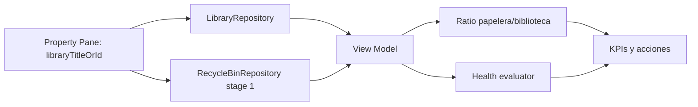

# Auditoría funcional y técnica

## Conclusión ejecutiva

El proyecto actual no implementa el webpart de elementos de biblioteca que pide el nombre del producto ni la corrección actual del usuario. Implementa otro producto: un calculador de espacio ocupado por la papelera de primer y segundo nivel del sitio. La desviación no es cosmética; afecta a requisitos, arquitectura, datos, tests, manifiestos, documentación y empaquetado.

## Objetivo funcional canónico

El webpart correcto debería:

1. Resolver una biblioteca concreta por título o ID.
2. Mostrar el `ItemCount` real de esa biblioteca.
3. Consultar la papelera de primer nivel del sitio.
4. Agregar conteo y tamaño de papelera cuando sea posible.
5. Calcular ratio papelera/biblioteca.
6. Evaluar salud con umbrales configurables.
7. Permitir refresco manual y apertura de biblioteca y papelera.

## Implementación observada hoy

El código real hace esto:

1. Consulta `/_api/web/RecycleBin`.
2. Consulta `/_api/site/RecycleBin`.
3. Agrega tamaño y conteo por etapa.
4. Calcula un total agregado de papelera.
5. Marca `stage2PermissionLimited` si la etapa 2 es inaccesible.
6. Muestra tarjetas por nivel, health badge, refresco y enlace a la papelera.

No hace esto:

- no resuelve ni valida una biblioteca objetivo;
- no obtiene `ItemCount` de biblioteca;
- no calcula ratio;
- no abre la biblioteca;
- no filtra papelera por origen documental;
- no implementa cache, reintentos ni telemetría como pedía la especificación técnica original.

## Cobertura funcional

| Capacidad | Esperado | Implementado hoy | Estado |
| --- | --- | --- | --- |
| Selección de biblioteca | Sí | No | Falta crítica |
| Conteo de biblioteca | Sí | No | Falta crítica |
| Conteo de papelera de primer nivel | Sí | Sí | Parcial |
| Tamaño de papelera | Sí | Sí | Parcial |
| Ratio papelera/biblioteca | Sí | No | Falta crítica |
| Abrir biblioteca | Sí | No | Falta alta |
| Abrir papelera | Sí | Sí | Implementado |
| `partialData` | Sí | Sí | Implementado |
| Health badge | Sí | Sí | Implementado, pero con semántica distinta |
| Papelera de segundo nivel | No prioritaria | Sí | Fuera de alcance esperado |

## Hallazgos

### Críticos

1. Desviación funcional total del producto.
   El proyecto se construyó sobre una reinterpretación equivocada. Toda la vertical técnica está orientada a `RecycleBinSpaceCalculator` en lugar de a un diagnóstico `biblioteca + papelera de primer nivel`.

2. Error de sintaxis confirmado en localización.
   `src/webparts/recycleBinSpaceCalculator/loc/es-es.js` y `src/webparts/recycleBinSpaceCalculator/loc/en-us.js` fallan con `Unexpected identifier 'ErrorBoundaryTitle'` al validar sintaxis con `node --check`.

3. Pipeline de validación roto.
   `npm run build` falla hoy porque `recycleBinSpaceCalculatorRepository.test.ts` espera un header `Accept` que el repositorio no envía.

### Altos

1. Falta toda la capa de biblioteca.
   No existen `LibraryRepository`, `SiteStorageDiagnosticsWebPart`, `libraryTitleOrId`, `open library`, `ratio`, ni el modelo de vista previsto por la especificación original.

2. El diseño de datos no soporta el caso de uso prometido.
   La papelera es ámbito sitio. Incluso con una futura corrección, la relación con una biblioteca concreta exigirá filtrar por metadatos de origen; el código actual ni siquiera recibe contexto de biblioteca.

3. La UI actual refuerza el producto equivocado.
   Las tarjetas muestran `Papelera nivel 1`, `Papelera nivel 2` y `Total papelera`, con mensajes centrados en salud de papelera, no en comparación con biblioteca activa.

4. La documentación del proyecto estaba propagando la especificación equivocada.
   README, `project-intelligence`, `design-reference` y `provisioning-definition` describían el calculador de papelera y no el webpart de biblioteca.

5. Faltan capacidades no funcionales previstas.
   No hay cache, reintentos a 429/503, paginación real de papelera, telemetría ni abortado explícito de peticiones.

### Medios

1. Localización incompleta y hardcodes.
   Hay múltiples textos de UI hardcodeados en componentes y property pane (`Refrescar`, `Actualizando...`, `Abrir papelera`, `Sí`, `No`, mensajes de estado, títulos por defecto).

2. Semántica de salud acoplada al producto desviado.
   `evaluateHealth` clasifica la salud en función de umbrales de papelera y de la accesibilidad de la etapa 2, no del ratio biblioteca/papelera ni del volumen activo.

3. Manifest y empaquetado con señales de producto inacabado.
   `config/package-solution.json` sigue con `shortDescription`, `longDescription` y `developer` sin completar.

4. Señales de deuda técnica en TypeScript y lint.
   El proyecto emite advertencias por uso extensivo de `null` y presenta avisos de iconos no registrados en tests.

5. Hosts declarados más amplios que la validación real.
   El manifiesto declara soporte para Teams, pero no hay tratamiento específico del host ni evidencia de validación funcional en esos contextos.

## Problemas de arquitectura

### Programación

- El nombre del producto, el nombre del webpart y el modelo funcional no coinciden.
- La capa de servicios no está construida para un dominio de biblioteca; está cerrada sobre etapas de papelera.
- La cobertura de tests se centra en el caso equivocado y no protege el producto realmente esperado.

### SPFx

- El property pane expone opciones de desglose por etapas que no existirían en el producto canónico.
- La localización rota puede romper la carga del módulo en runtime.
- El manifiesto y el empaquetado publican un webpart válido técnicamente, pero funcionalmente mal alineado.

### SharePoint

- El uso de `/_api/site/RecycleBin` introduce alcance y permisos que no forman parte del objetivo correcto.
- Para el producto de biblioteca será imprescindible consultar metadatos de lista (`ItemCount`, `RootFolder`) y decidir cómo correlacionar residuos con la biblioteca.
- Si la correlación exacta no es viable, habrá que documentar claramente si el ratio es sitio-vs-biblioteca o biblioteca-vs-residuos atribuibles.

### Seguridad

- No he encontrado secretos versionados ni sinks inseguros adicionales en enlaces externos; `createSafeExternalLink` protege el enlace a la papelera.
- El principal riesgo de seguridad es de gobernanza y claridad: permisos, alcance y comportamiento declarados no coinciden con el producto esperado.

## Validación ejecutada

### `npm run build`

- build de TypeScript y webpack: pasa con advertencias.
- tests: falla 1 suite.
- error confirmado: el repositorio no envía los headers que exige el test del repositorio.

### `node --check`

- `src/webparts/recycleBinSpaceCalculator/loc/es-es.js`: falla.
- `src/webparts/recycleBinSpaceCalculator/loc/en-us.js`: falla.

## Orden recomendado de corrección

1. Corregir la documentación y fijar el objetivo canónico del proyecto.
2. Arreglar localización y pipeline roto para recuperar un baseline técnico estable.
3. Sustituir la vertical `RecycleBinSpaceCalculator` por la vertical correcta de biblioteca + papelera de primer nivel.
4. Añadir `LibraryRepository`, ratio, acción de abrir biblioteca y tests del flujo canónico.
5. Incorporar cache, reintentos, paginación y telemetría solo cuando el dominio correcto ya exista.